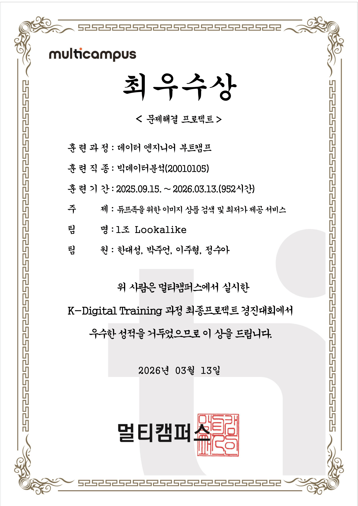

# 👗 Lookalike (Snap-Match) — 듀프족을 위한 AI 패션 이미지 검색 플랫폼

> **"비슷한 옷, 더 싸게"** — 이미지 한 장으로 유사 패션 상품을 찾고 최저가 5개 쇼핑몰을 한 번에 비교합니다.

[](https://python.org)
[](https://fastapi.tiangolo.com)
[](https://elastic.co)
[](https://airflow.apache.org)
[](https://spark.apache.org)
[](https://kafka.apache.org)
[](https://docker.com)
[](https://cloud.google.com)

---

## 🧑‍🤝‍🧑 팀명: **Lookalike**

### 👑 팀장  
- **한대성** (Lead DE · Data Engineer · Pipeline Architect): 아키텍처 설계, Docker 인프라, Airflow · Spark 설계 및 튜닝, Kafka 운영 파이프라인, CI/CD, Core FastAPI 백엔드, 프로젝트 전체 총괄

### 🌱 팀원  
- **박주언** (Data Engineer · ETL): 크롤러 개발, Spark 전처리, HDFS 적재, ERD 설계, Naver API 연동
- **이주형** (ML Engineer · MLOps): AI 모델 스택 선정, YOLOv11 파인튜닝, VLM(LLaVA) 학습·프롬프트 설계, ML 파이프라인-Airflow DAG 최종 연결
- **정수아** (AI Researcher · Vector Search): YOLOv11 파인튜닝, 이미지 처리 파이프라인, Fashion-CLIP/SBERT 임베딩 검색 로직 구현(FastAPI ML Serving), Vector search(Late Fusion-RRF)
  
### 🗓 프로젝트 기간  
**2026년 01월 12일 ~ 2026년 03월 11일**  
**서비스 URL**: https://lookalike.duckdns.org

> [!IMPORTANT]
> **🕒 무료서버로 인한 한시적 운영 안내 (2026.03 ~ 2026.06)**
> - **운영 시간**: 평일 09:00 ~ 20:00 (KST)
> - **참고**: 서버 자원 절약을 위해 주말 및 야간에는 서비스가 제한될 수 있습니다.


---

## 🏆 수상

> **멀티캠퍼스 K-Digital Training · 데이터 엔지니어 부트캠프**  
> 문제해결 프로젝트 경진대회 **최우수상** — 2026.03.13

<div align="center">
  
</div>

---

## 📋 프로젝트 개요

### 주제
**AI 패션 이미지 검색 기반 듀프 쇼핑 최저가 비교 서비스**

### 📚 배경 및 차별점
현대 소비자의 구매 패턴은 **'듀프(Dupe) 소비'** 로 진화하고 있습니다. 에이블리 사례에서 확인되듯 듀프족의 등장은 SPA 시장을 전년 대비 2배 이상 성장시켰습니다. 그러나 기존 네이버 렌즈 등 범용 이미지 검색은 패션 도메인에 특화되지 않아 정확도가 낮고, 가격 비교 연동 서비스가 전무합니다.

| 구분 | 기존 서비스 (네이버 렌즈 등) | **Lookalike** |
|---|---|---|
| **도메인 특화** | 범용 이미지 검색 | 패션 특화 (YOLOv11 + Fashion-CLIP) |
| **검색 방식** | 이미지 단독 | 이미지 + 텍스트 Late Fusion (이미지 70% · 텍스트 30%) |
| **가격 비교** | 미제공 | 실시간 최저가 5개 쇼핑몰 비교 (Naver 쇼핑 API) |
| **텍스트 이해** | 미제공 | VLM(LLaVA) 상품 설명 생성 + SBERT 임베딩 |
| **파이프라인** | N/A | Airflow DAG 완전 자동화 (매일 새벽 02:00) |

### 🎯 핵심 목표
1. **도메인 특화 검색**: YOLOv11 객체 탐지와 Fashion-CLIP 기반 유사도 탐색
2. **복합 검색 (Late Fusion)**: 이미지 + 텍스트 동시 입력 최적화
3. **완전 자동화 파이프라인**: Airflow 기반 매일 자동 수집 및 ML 추론 적재
4. **대규모 분산 아키텍처**: 4개 코어망 통합 (API, 데이터 파이프라인, ML 추론, 관제망)

---

## 📁 프로젝트 구조

```text
snap-match/
├── docs/                          # 📚 시스템 가이드 및 매뉴얼 (하단 링크 참조)
├── data-pipeline/                 # 🔧 데이터 엔지니어링 및 파이프라인 망
│   ├── airflow/                   # Apache Airflow DAGs 및 오퍼레이터 스케줄링
│   ├── crawlers/                  # 크롤링 봇 스크립트
│   ├── database/                  # RDBMS 초기 스키마 마이그레이션 (더미 및 Seed)
│   ├── elasticsearch/             # ES kNN 인덱스 매핑 및 쿼리 튜닝
│   ├── kafka/                     # 메트릭 및 로그 큐 프로듀서/컨슈머
│   └── spark/                     # PySpark 기반 대용량 병렬 데이터 전처리 잡(Jobs)
├── ml-models/                     # 🤖 머신러닝 인퍼런스 레이어
│   ├── api/                       # ML 전용 FastAPI 라우터 (YOLO 및 Vector 추출)
│   └── weights/                   # 파인튜닝된 YOLOv8 모델 가중치 (.pt)
├── web/                           # 🌐 코어 백엔드 및 웹 프론트엔드
│   ├── backend/                   # 메인 FastAPI 앱 엔진
│   │   ├── app/
│   │   │   ├── core/              # 보안(Auth), ES 연결, 환경 변수 등 핵심 유틸
│   │   │   ├── models/            # SQLAlchemy ORM 계층
│   │   │   ├── routers/           # `/api/*` 클라이언트 통신 API 엔드포인트
│   │   │   └── services/          # 도메인 비즈니스 로직, 모니터링 콜렉터 및 Kafka 연동
│   │   └── requirements.txt
│   └── frontend/                  # 초경량 SSR 뷰 및 정적 자산
│       ├── static/                # CSS, JS, Image 에셋
│       └── templates/             # Jinja2 렌더링 기반 템플릿(HTML)
├── scripts/                       # 🛠️ 백그라운드 구동 등 수동 제어 쉘 스크립트 모음
├── config/                        # ⚙️ 통합 커스텀 설정 보관소
├── Dockerfile.*                   # 각 파트별 커스텀 이미지 빌드 명세 (.airflow, .fastapi 등)
├── docker-compose.yml             # 통합 클러스터 Full-Mesh 스케줄링 메인 엔트리
└── docker-compose.gpu.yml         # ML 추론 진영 NVIDIA GPU 가속 오버라이드 지원망
```

---

## 🏗️ 시스템 아키텍처 및 기술 스택

### 1. 시스템 아키텍처 구성도
```text
┌──────────────────────────────────────────────────────────────────────┐
│  ① 배치 데이터 파이프라인  (Airflow DAG · 매일 02:00 자동 실행)       │
│                                                                      │
│  Airflow → Crawlers×5 → Hadoop HDFS → Spark ETL                     │
│       → PostgreSQL / MongoDB                                         │
│       → YOLOv11 → Fashion-CLIP → ES (image_embedding)               │
│       → VLM(LLaVA) → SBERT    → ES (text_embedding)                 │
│       → Naver 쇼핑 API → PostgreSQL (최저가)                         │
└──────────────────────────────────────────────────────────────────────┘
┌──────────────────────────────────────────────────────────────────────┐
│  ② 실시간 서비스 레이어                                               │
│                                                                      │
│  사용자 → Main FastAPI → ML FastAPI (GPU)                            │
│       → [이미지만] Fashion-CLIP → ES KNN                             │
│       → [텍스트만] SBERT → ES KNN                                    │
│       → [복합]     Late Fusion(이미지×0.7 + 텍스트×0.3) → ES KNN    │
│       → 상품 정보 조회 (PostgreSQL + Naver API) → 결과 반환           │
└──────────────────────────────────────────────────────────────────────┘
┌──────────────────────────────────────────────────────────────────────┐
│  ③ 운영 모니터링 (어드민 전용)                                        │
│                                                                      │
│  Filebeat → Kafka → KafkaLogConsumer → ES → 어드민 대시보드          │
│  Docker SDK Fallback (Kafka 장애 시 자동 전환)                        │
│  Slack 알람 + Auto-Recovery (docker.restart() 자동 실행)             │
└──────────────────────────────────────────────────────────────────────┘
```

### 2. 주요 기술 스택

| 분류 | 기술 스택 | 역할 |
|---|---|---|
| **AI / ML** | YOLOv11, Fashion-CLIP, VLM(LLaVA), SBERT | 객체 탐지, 이미지/텍스트 벡터화, 자연어 설명 생성 |
| **Data Pipeline** | Apache Airflow, Hadoop HDFS, PySpark, Kafka | 9단계 자동화 워크플로우, 분산 전처리, 실시간 스트리밍 |
| **Service / DB** | FastAPI (Main/ML), PostgreSQL, MongoDB, Elasticsearch, Redis | 비동기 API, 트랜잭션 DB, NoSQL, kNN 벡터 검색, 세션 관리 |
| **Infra** | AWS EC2 (g4dn.xlarge), Docker Compose, GitHub Actions | 분산 클러스터링, GPU 가속, CI/CD |

---

## 🔧 주요 기능

- **이미지 검색**: 의류 사진 업로드 → YOLOv11 배경 제거 → Fashion-CLIP 벡터 변환 → Elasticsearch KNN으로 유사 상품 상위 6개 반환
- **텍스트 검색**: 자연어 입력(예: "오버사이즈 베이지 린넨 셔츠") → SBERT 의미 벡터로 KNN 검색
- **복합 검색 (Late Fusion)**: 이미지 + 텍스트 동시 입력 시, 두 벡터를 가중 결합(이미지 70% + 텍스트 30%)하여 시각적 유사도와 텍스트 의도를 동시 반영
- **최저가 비교**: Naver 쇼핑 API로 유사 상품별 최저가 5개 쇼핑몰 실시간 조회 후 가격 오름차순 반환
- **운영 모니터링**: 어드민 대시보드를 통한 컨테이너 자원 메트릭 및 실시간 에러 로그 관측

---

## 🚀 시작하기 & 실행 방법

본 클러스터는 Build-once 전략이 적용되어 최초 빌드 이후 초고속 부팅(Fast Boot)을 지원합니다.

### 1. 사전 요구사항
* **Docker & Docker Compose** (v2.20+)
* **NVIDIA GPU** (VRAM 16GB 권장) + NVIDIA Container Toolkit

### 2. 환경 변수 설정
```bash
cp .env.example .env
# .env 파일 내 포트, 시크릿 키, NAVER API KEY 등 필수 정보 입력
```

### 3. 클러스터 실행
```bash
# 전체 파이프라인 백그라운드 구동 배포
docker-compose up -d --build

# ML 컨테이너 GPU 오버라이드 기동 시
docker-compose -f docker-compose.yml -f docker-compose.gpu.yml up -d
```

### 4. 데이터베이스 및 배치 초기화
```bash
# 초기 RDBMS 데이터베이스 스키마 및 마이그레이션 적재
bash scripts/apply_db_changes.sh

# 배치 파이프라인 수동 트리거 (Airflow 접속 후 또는 CLI)
docker exec airflow-scheduler airflow dags trigger lookalike_batch_pipeline
```
- 상세 설정 및 개별 컨테이너 구동 방법은 `docs/SETUP.md`를 참고하세요.

---

## 🐛 트러블슈팅 및 성능 최적화

| 항목 | 개선 사항 및 해결 방법 |
|---|---|
| **어드민 대시보드 로딩 개선** | 순차 조회로 20초 걸리던 병목을 `asyncio.gather()` 병렬화와 Redis 캐시(TTL 25초)로 100ms 이하(200배)로 개선 |
| **ES CPU 부하 완화** | 단건 인덱싱 로직을 Kafka 버퍼 단위 Bulk(50건) 호출로 변경 및 `refresh_interval` 조절로 부하를 91%에서 30%대로 감소 |
| **로그망 장애 복원 (SPOF)**| Kafka 장애 지연 시 로그 통신이 두절되는 현상을 방어하기 위해 Docker SDK Fallback 이중 회선 라우팅망 구축 |
| **ML VRAM OOM 통제**| T4 16GB 서버에서 ML 모델 동시 로드로 뻗는 문제를 Airflow 타임스케줄링 격리 및 `empty_cache()` 처리로 방어 |
| **크롤링 차단 우회**| ZARA 등 React SPA 쇼핑몰 봇 차단을 Selenium Headless, 랜덤 딜레이, 마우스 시뮬레이션 복합 대응으로 뚫어냄 |

*(추가 상세 내용 및 FastAPI 이벤트 룹 디버그 로깅은 `docs/admin/troubleshooting.md` 참고)*

---

## 👨‍💻 개발자 노트

### 알려진 한계 사항 및 자원 확보 시 개선 방향

| 기능 / 구성 요소 | 제약 상황 (자원 한계) | 자원 확보 시 개선 방향 |
|---|---|---|
| **LLaVA 모델 크기** | VRAM 부족으로 7B 모델만 사용 가능. 13B 이상 로드 불가 → 색상·소재 세분화 정확도 저하 | GPT-4o Vision / Gemini API 전환으로 로컬 VRAM 의존 제거 |
| **Spark Executor 메모리** | RAM 부족으로 executor-memory 1g, driver-memory 1g로 하향. 대용량 데이터 처리 시 OOM Killer로 Executor 강제 종료 | EMR / Glue 이관 또는 다중 EC2 Spot Instance 클러스터로 전환 |
| **HDFS Replication Factor** | 디스크 공간 부족으로 Replication Factor 3 → 1로 강제 축소. 데이터 유실 위험 내재 | S3 전환 시 내장 11-nine 내구성으로 자동 해결 |
| **Kafka 단일 브로커** | RAM 부족으로 Kafka 브로커 1개만 운영. 파티션 Replication 불가 → 단일 장애점(SPOF) 내재. Fallback으로 보완했으나 근본 해결은 아님 | 3-브로커 클러스터 또는 MSK(Managed Kafka)로 전환, ISR Replication Factor 3 적용 |
| **ES JVM Heap** | 권장 Heap(RAM의 50%)인 7GB 할당 불가. 2GB로 축소 운영 → GC Pause 빈발, KNN 검색 응답 지연 간헐적 발생 | OpenSearch Serverless 또는 전용 ES 노드 분리로 Heap 충분히 확보 |
| **Airflow 전용 DB 격리** | RAM 부족으로 Airflow 메타 DB를 서비스용 PostgreSQL과 공유. DB 부하 중첩 시 Airflow 스케줄러 지연 발생 | Airflow 전용 PostgreSQL 컨테이너 분리 또는 RDS 사용 |
| **YOLOv11 배치 추론 크기** | VRAM 공유 부담으로 `batch_size=4`로 제한. 이론상 최적(32~64) 대비 배치 추론 처리량 저하 | A10G / A100 GPU 사용 시 `batch_size=32` 이상으로 처리량 8배 이상 향상 |

---

## 📄 공식 도큐먼트 (Documentation)

자세한 시스템 아키텍처 및 세부 운영 매뉴얼은 `docs/` 내에 체계적으로 명세화되어 있습니다.

### 🌟 튜토리얼 및 아키텍처
* **[통합 요약 명세서 (SUMMARY.md)](docs/SUMMARY.md)**: 전체 시스템 구조 Overview.
* **[로컬 셋업 가이드 (SETUP.md)](docs/SETUP.md)**: 전체 인프라망 수동 디버그 및 셋업 매뉴얼.
* **[코어 백엔드 시스템망 (core_backend_system.md)](docs/architecture/core_backend_system.md)**: API 설계, DB 스키마, Auth 종합 기술.
* **[프론트엔드 UI 아키텍처망 (frontend_ui_system.md)](docs/architecture/frontend_ui_system.md)**: SSR/SPA 하이브리드 구조 및 통합 에셋 관리 규약.
* **[머신러닝 및 검색망 (search_and_ml_system.md)](docs/architecture/search_and_ml_system.md)**: YOLO Crop 및 ES kNN 3단계 전략 맵.
* **[통합 파이프라인망 (data_pipeline_system.md)](docs/architecture/data_pipeline_system.md)**: 에어플로우 기반 9단계 자동화 크롤링 적재.

### 🛠️ 관리자 운영 관제
* **[인프라 모니터링망 (infra_monitoring_system.md)](docs/admin/infra_monitoring_system.md)**: 하드웨어 메트릭 수집 구조.
* **[로그 수집망 (log_monitoring_system.md)](docs/admin/log_monitoring_system.md)**: Filebeat-Kafka 안전 로그망.
* **[알림 봇 시스템 (alert_monitoring_system.md)](docs/admin/alert_monitoring_system.md)**: Slack 에러 알림.

---

## 📚 참고문헌
1. 노준영, 『요즘 소비 트렌드 2026』, 슬로디미디어, 2025
2. DeepFashion2: A Versatile Benchmark for Detection, Pose Estimation, Segmentation and Re-Identification of Clothing Images
3. Fashion-CLIP: Leveraging CLIP for Fashion Image-Text Retrieval
4. YOLOv11: Real-Time Object Detection and Segmentation
5. LLaVA: Visual Instruction Tuning, Liu et al., 2023
6. Sentence-BERT: Sentence Embeddings using Siamese BERT-Networks, Reimers & Gurevych, 2019

---

<div align="center">
  <b>작성자: 한대성</b> | 최종 업데이트: 2026-03-18
</div>